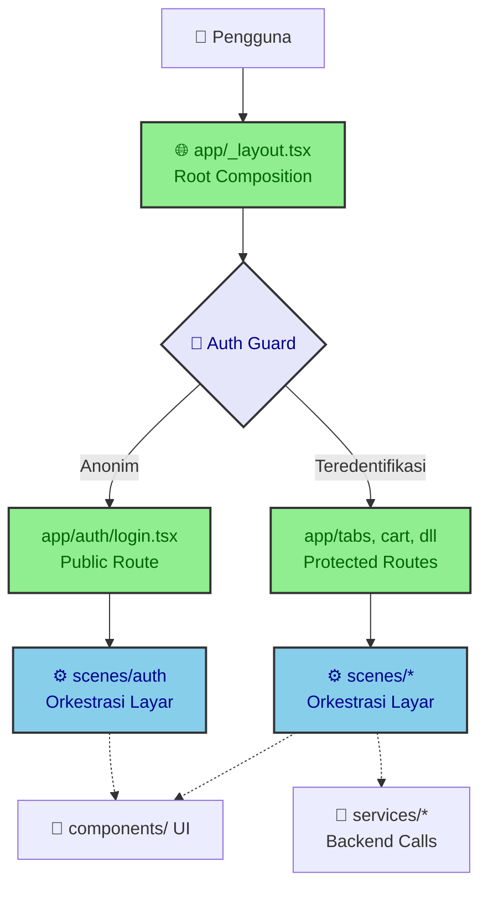

# Arsitektur dan Routing

Dokumen ini menguraikan arsitektur tingkat tinggi dari aplikasi Apotek 
E-commerce, khususnya terkait pembagian tanggung jawab antara perutean 
(*routing*) dan implementasi layar (*screen implementation*). Dengan memahami 
batas-batas ini, Anda dapat menjaga kebersihan basis kode dan mencegah 
kebocoran logika bisnis ke dalam konfigurasi navigasi.

## Pemisahan Konsep: App vs Scenes

Untuk mengatasi kompleksitas dari Expo Router dan mempertahankan modularitas, 
proyek ini menerapkan pemisahan yang sangat tegas antara folder `app/` dan 
folder `scenes/`.

- **`app/` (Expo Router Boundaries)**: Direktori ini secara eksklusif hanya 
  digunakan untuk mendefinisikan *layout*, *nested stacks*, penjaga otentikasi 
  (*auth guards*), dan URL *deep-linking*. File *route* di sini harus berupa 
  satu baris (*one-line*) atau *wrapper* tipis yang mengekspor komponen dari 
  `scenes/`.
- **`scenes/` (Screen Orchestration)**: Direktori ini adalah tempat di mana 
  implementasi UI yang sesungguhnya berada. Sebuah layar (*scene*) merangkai 
  Hooks, layanan (*services*), dan komponen [[Sistem Desain UI|Tamagui UI]]. 
  Layar sebaiknya tidak memiliki akses langsung ke 
  [[Integrasi Backend Supabase|Supabase]], melainkan mendelegasikannya melalui 
  lapisan *service*.

<!-- prettier-ignore -->
> [!important]
> **Dilarang keras** memasukkan [[State Management|logika status (state)]], 
> pemanggilan *service*, atau implementasi UI langsung ke dalam file *route* di 
> folder `app/`. Pengecualian 
> kecil hanya berlaku untuk `app/_layout.tsx`, `app/index.tsx`, 
> `app/google-auth.tsx`, dan `app/+native-intent.tsx`.

## Rute yang Terproteksi (Protected Routes)

Sistem memastikan pengguna anonim tidak dapat mengakses area aplikasi yang 
memerlukan otorisasi (misalnya profil atau keranjang belanja). Perlindungan 
ini diterapkan melalui dua lapisan.

1. **Daftar *Hardcoded* Root**: Di dalam `app/_layout.tsx`, terdapat daftar 
   halaman terlindungi yang didefinisikan dalam `PROTECTED_ROUTE_GROUPS = 
   ['(tabs)', 'cart', 'product-details', 'payment-success']`. Root layout akan 
   mengalihkan (*redirect*) pengguna yang tidak diautentikasi kembali ke `/login`.
2. **Pertahanan Ekstra (*Defense in Depth*)**: Setiap *stack layout* di grup 
   yang terlindungi (misalnya `app/(tabs)/_layout.tsx`) tetap dibungkus dengan 
   `withAuthGuard`.

<!-- prettier-ignore -->
> [!warning] Menambahkan Rute Rahasia Baru
> Jika Anda membuat direktori terlindungi baru (misalnya rute khusus *admin*), 
> Anda **wajib** mendaftarkan direktori tersebut ke dalam senarai 
> `PROTECTED_ROUTE_GROUPS`. Tanpa pendaftaran ini, perutean root tidak akan 
> melakukan *redirect* otomatis.

## Struktur Root Composition

File `app/_layout.tsx` adalah komposisi dasar (*composition root*) bagi seluruh 
aplikasi. Di file ini, seluruh penyedia (*providers*) diinisialisasi dalam 
urutan hierarkis yang ketat. 

Urutan tumpukan (*Provider Stack*) dari luar ke dalam adalah:
`Gesture Handler` → `Safe Area` → `Redux Provider` → `Tamagui Provider` → 
`React Navigation Theme`.

Semua layar akan melewati *splash screen gate* di tingkat ini, memastikan bahwa 
aset dasar dan sesi pengguna berhasil di-*bootstrap* sebelum UI awal dimuat.

## Pengetesan Tipe Rute (Typed Routing)

Karena aplikasi menggunakan Expo Router yang mendukung parameter URL, proyek ini 
secara manual mendefinisikan *interface* TypeScript secara ketat di 
`types/routes.types.ts`. 

Setiap kali Anda menavigasi (misalnya menggunakan fungsi `router.push`), tipe-
tipe payload tersebut dijamin sesuai. Jika sebuah layar memerlukan `orderId`, 
TypeScript akan mencegah kompilasi jika parameter tersebut lupa disertakan.

<!-- prettier-ignore -->
> [!note] Aturan Pembaruan Parameter
> **Jangan pernah** menambahkan atau mengubah parameter URL dinamis pada file 
> *route* tanpa memperbarui kontrak pendukungnya di dalam 
> `types/routes.types.ts`.

## Referensi Terkait

- Panduan awal menjalankan *server* pengembangan: [[Panduan Setup Lokal]]
- Penjelasan manajemen status hibrida Redux/Zustand: [[State Management]]
- Pemanggilan *Edge Functions* dan operasi *database*: [[Integrasi Backend Supabase]]
- Pembuatan antarmuka pengguna *(UI components)*: [[Sistem Desain UI]]
