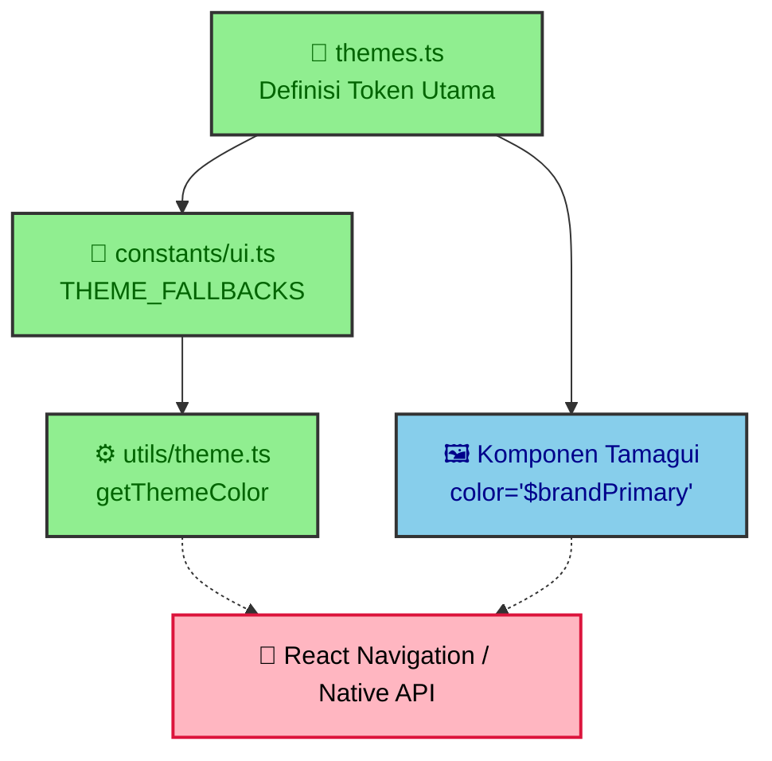

# Kustomisasi Tema dan Warna

Dokumen ini adalah panduan spesifik bagi *developer* atau *UI Designer* yang 
ingin melakukan perubahan warna (misalnya warna tombol utama, warna latar 
belakang layar, atau aksen *dark mode*) di aplikasi Apotek E-commerce. 

Karena aplikasi ini menggunakan arsitektur Tamagui, pengubahan warna tidak bisa 
dilakukan secara sembarangan melalui *file* komponen, melainkan harus 
disentralisasi di lapisan konfigurasi tema.

## 1. Alur Kerja Modifikasi Warna

Jika Anda ingin mengubah skema warna, pahami aliran kebergantungan file 
berikut:



1. **`themes.ts`**: Ini adalah sumber kebenaran (*Source of Truth*). Di sinilah 
   skema warna terang (`brand`) dan gelap (`brand_dark`) didefinisikan. Jika 
   Anda ingin mengubah warna utama *(primary)* tombol dari Hijau ke Biru, Anda 
   mengubah properti `brandPrimary` dan `accentBrand` di file ini.
2. **`constants/ui.ts`**: **WAJIB DISELESAIKAN BERSAMAAN**. Setelah Anda 
   menambahkan atau mengubah variabel di `themes.ts`, Anda harus menyalin nilai 
   *hex* tersebut ke objek `THEME_FALLBACKS` dan `DARK_THEME_FALLBACKS` di 
   file ini.

<!-- prettier-ignore -->
> [!warning] Bahaya Layar Kosong (White Screen)
> Lupa menyinkronkan token baru dari `themes.ts` ke dalam `constants/ui.ts` 
> akan menyebabkan komponen yang menggunakan utilitas pelacakan warna kustom 
> gagal melakukan perenderan, terutama saat transisi *dark-mode*.

## 2. Cara Mengonsumsi Warna di Komponen

Setelah warna didefinisikan, cara pemanggilannya berbeda tergantung tipe 
komponen yang Anda modifikasi (misalnya tombol atau teks).

### Untuk Komponen Tamagui (Mayoritas Kasus)
Gunakan referensi *string* dengan awalan `$` yang menunjuk pada token tema.
```tsx
// BENAR: Menggunakan Token Tema (Bisa transisi Light/Dark Mode)
<Button backgroundColor="$brandPrimary" color="$onPrimary">
  Simpan
</Button>

// SALAH: Jangan gunakan getThemeColor untuk properti Tamagui
<Button backgroundColor={getThemeColor(theme, 'brandPrimary')}>
  Simpan
</Button>
```

### Untuk API React Native Murni (Kasus Khusus)
Jika Anda terpaksa memberikan gaya pada komponen bawaan OS (misalnya *Header 
React Navigation* atau *StatusBar* yang tidak mengerti sintaks `$`), barulah 
Anda gunakan jalur evakuasi (*escape hatch*).
```tsx
import { getThemeColor } from '@/utils/theme';

// Hanya gunakan ini untuk properti gaya spesifik React Native
const headerBg = getThemeColor(theme, 'headerBackground');
```

## 3. Menambahkan Modifikasi Komponen UI (Seperti Tombol)

Jika perubahan warna melibatkan varian khusus yang hanya berlaku untuk 
komponen tertentu (misalnya Anda ingin membuat tombol khusus `PayNowButton`):

1. **Jangan letakkan di rute (`app/`) atau layar (`scenes/`)**.
2. **Buat di `components/elements/`**. Anda bisa memperluas tombol standar 
   dengan cara:
   ```tsx
   import { Button, styled } from 'tamagui';
   
   export const PayNowButton = styled(Button, {
     backgroundColor: '$success',
     color: '$white',
     pressStyle: {
       backgroundColor: '$successSoft',
     },
   });
   ```
3. Komponen bentuk baru ini secara otomatis akan mematuhi aturan tema terang 
   dan gelap yang telah diatur di `themes.ts`.

## Referensi Terkait

Pemahaman mengenai cara memodifikasi UI ini sangat berkaitan erat dengan 
dokumen-dokumen berikut:

- Standar dan arsitektur hierarki komponen: 
  [[Sistem Desain UI]]
- Cara merender UI untuk mencegah *crash* saat pengujian Jest: 
  [[Strategi Testing]]
