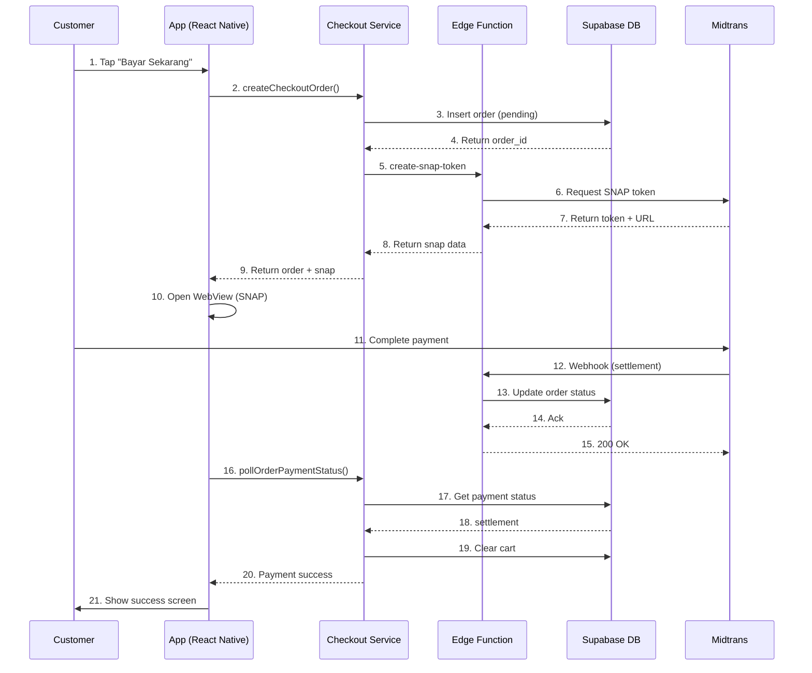
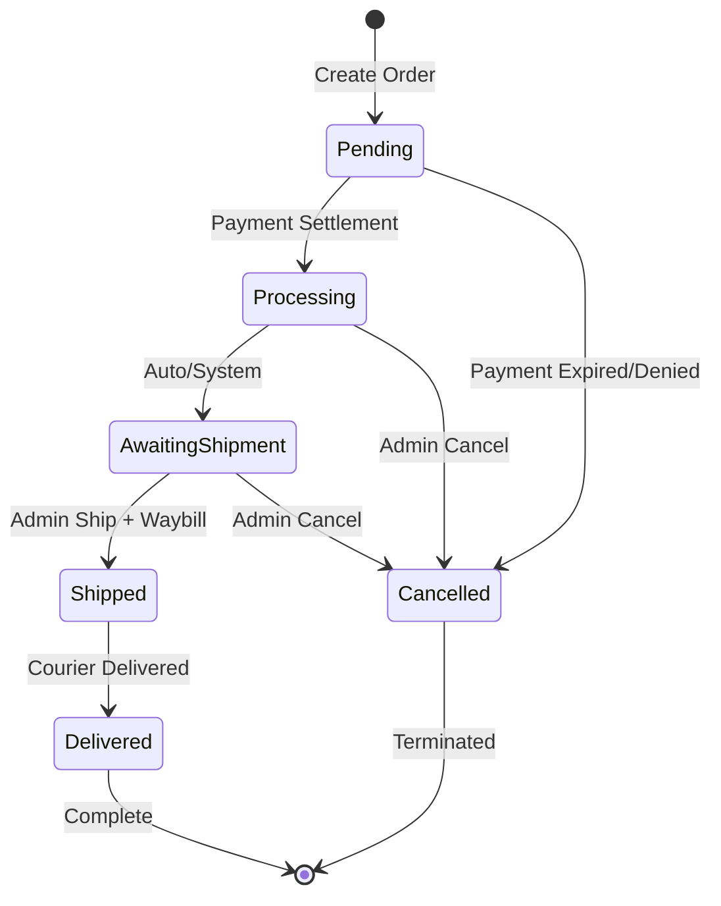
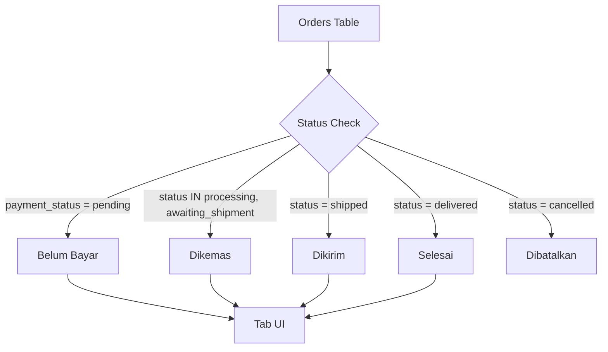
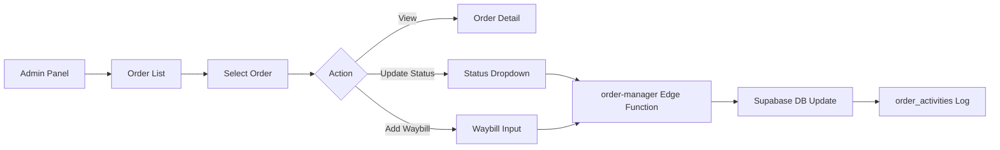
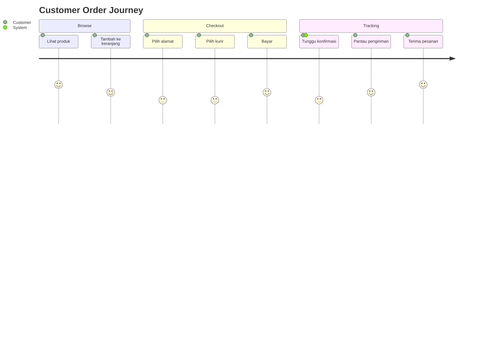
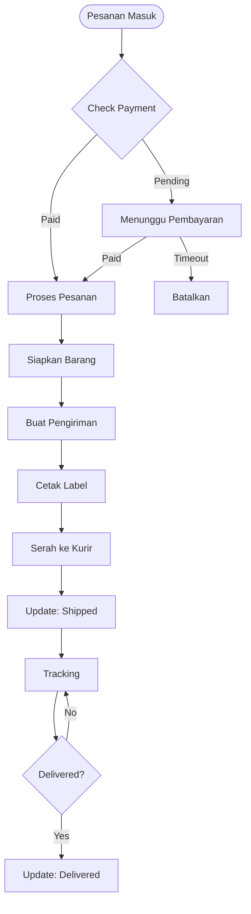

# Spesifikasi Flow Checkout dan Pesanan

## 1. Tujuan & Scope

### Tujuan

Dokumen ini mendefinisikan spesifikasi lengkap untuk:

- Flow checkout dari keranjang hingga pembayaran berhasil
- Integrasi Midtrans SNAP untuk pembayaran
- State machine status pesanan
- Integrasi Biteship untuk pengiriman
- Panel admin untuk manajemen pesanan
- UI/UX untuk status pesanan dengan card Belum Bayar, Dikemas, Dikirim

### Scope

**In Scope:**

- Flow checkout end-to-end
- Status pesanan dan transisi
- Integrasi Midtrans webhook
- Integrasi Biteship
- Admin panel order management
- UI komponen status pesanan

**Out of Scope:**

- Payment gateway selain Midtrans
- Fitur marketplace multi-seller
- Sistem review produk
- Loyalty/poin program

### Audience

- Frontend developers (React Native)
- Backend developers (Supabase Edge Functions)
- Admin panel developers (Refine)
- QA engineers

---

## 2. Definisi

| Istilah             | Definisi                                                             |
| ------------------- | -------------------------------------------------------------------- |
| **Belum Bayar**     | Status pesanan yang menunggu pembayaran dari customer                |
| **Dikemas**         | Status pesanan yang sudah dibayar dan sedang dipersiapkan oleh admin |
| **Dikirim**         | Status pesanan yang sudah diserahkan ke kurir dan dalam perjalanan   |
| **Selesai**         | Status pesanan yang sudah diterima oleh customer                     |
| **SNAP**            | Midtrans payment page yang di-embed via WebView                      |
| **Idempotency Key** | Unique key untuk mencegah duplikasi order saat retry                 |
| **Waybill**         | Nomor resi pengiriman dari kurir                                     |
| **Webhook**         | HTTP callback dari Midtrans/Biteship untuk notifikasi status         |

---

## 3. Requirements, Constraints & Guidelines

### REQ-001: Status Kategori Pesanan

Sistem harus menampilkan 4 kategori utama status pesanan:

- **Belum Bayar**: `payment_status = 'pending'`
- **Dikemas**: `status IN ('processing', 'awaiting_shipment')` dan `payment_status = 'settlement'`
- **Dikirim**: `status = 'shipped'`
- **Selesai**: `status = 'delivered'`

### REQ-002: Count Badge per Kategori

Setiap kategori status harus menampilkan jumlah pesanan dengan badge count (contoh: "Belum Bayar (3)").

### REQ-003: Tab Navigation

UI harus menggunakan tab horizontal scrollable untuk navigasi antar kategori status.

### REQ-004: Order Card Component

Setiap pesanan ditampilkan dalam card dengan informasi:

- Nomor order
- Tanggal pemesanan
- Status badge (warna sesuai status)
- Preview produk (nama, gambar, qty)
- Total harga
- Tombol aksi (Track, Bayar, dll)

### REQ-005: State Machine Validation

Transisi status harus divalidasi sesuai aturan:

```
pending → [processing, cancelled]
paid → [awaiting_shipment, processing, cancelled]
processing → [shipped, cancelled]
shipped → [delivered]
```

### SEC-001: Webhook Signature Verification

Semua webhook dari Midtrans harus diverifikasi signature-nya menggunakan SHA-512 HMAC.

### SEC-002: Idempotency

Webhook yang sama (berdasarkan event_key) tidak boleh diproses lebih dari sekali.

### GUD-001: Mobile-First Design

UI harus dioptimalkan untuk mobile dengan touch target minimum 48x48px.

### GUD-002: Indonesian Language

Semua label status menggunakan Bahasa Indonesia (Belum Bayar, Dikemas, Dikirim, dll).

### CON-001: Midtrans Dependency

Sistem bergantung pada Midtrans untuk pemrosesan pembayaran.

### CON-002: Biteship Dependency

Sistem bergantung pada Biteship untuk tracking pengiriman.

---

## 4. Interfaces & Data Contracts

### 4.1 Database Schema

#### Tabel: orders

```typescript
interface Order {
  id: string; // UUID primary key
  user_id: string; // References profiles.id
  status: string; // Order status
  payment_status: PaymentStatus; // Midtrans payment status
  payment_type: PaymentType | null; // Payment method
  total_amount: number; // Total order value
  gross_amount: number | null; // Amount before discount
  shipping_cost: number | null; // Shipping fee
  shipping_etd: string | null; // Estimated delivery
  courier_code: string | null; // Courier identifier
  courier_service: string | null; // Service type
  shipping_address_id: string | null; // Delivery address
  waybill_number: string | null; // Tracking number
  biteship_order_id: string | null; // Biteship reference
  midtrans_order_id: string | null; // Midtrans reference
  checkout_idempotency_key: string | null; // Duplicate prevention
  created_at: string;
  updated_at: string | null;
}
```

#### Tabel: order_items

```typescript
interface OrderItem {
  id: string;
  order_id: string;
  product_id: string | null;
  quantity: number;
  price_at_purchase: number; // Snapshot price
  created_at: string;
}
```

#### Enum: payment_status

```typescript
type PaymentStatus =
  | 'pending' // Menunggu pembayaran
  | 'settlement' // Pembayaran berhasil
  | 'capture' // Pembayaran dikonfirmasi
  | 'deny' // Pembayaran ditolak
  | 'expire' // Pembayaran kadaluarsa
  | 'cancel' // Pembayaran dibatalkan
  | 'refund' // Pengembalian dana penuh
  | 'partial_refund' // Pengembalian sebagian
  | 'chargeback' // Sengketa chargeback
  | 'partial_chargeback' // Chargeback sebagian
  | 'authorize'; // Otorisasi (belum capture)
```

### 4.2 Edge Functions

#### create-snap-token

**Method:** POST  
**Headers:** Authorization: Bearer {access_token}  
**Body:**

```json
{
  "order_id": "uuid"
}
```

**Response:**

```json
{
  "snap_token": "string",
  "redirect_url": "string"
}
```

#### order-manager

**Method:** POST  
**Headers:** Authorization: Bearer {admin_token}  
**Body (transition_status):**

```json
{
  "action": "transition_status",
  "orderId": "uuid",
  "payload": {
    "to": "shipped",
    "waybill_number": "JNE123456",
    "waybill_source": "manual",
    "notes": "Order shipped via JNE"
  }
}
```

**Body (sync_tracking):**

```json
{
  "action": "sync_tracking",
  "orderId": "uuid"
}
```

#### midtrans-webhook

**Method:** POST  
**Body:** Midtrans webhook payload  
**Response:** `{"status": "ok"}` (always 200)

### 4.3 API Responses

#### Order List Response

```typescript
interface OrderListItem {
  id: string;
  created_at: string;
  midtrans_order_id: string | null;
  gross_amount: number | null;
  total_amount: number;
  courier_service: string | null;
  payment_status: string;
  status: string;
  order_items: {
    id: string;
    quantity: number;
    products: {
      id: string;
      name: string;
      slug: string;
    } | null;
  }[];
}
```

---

## 5. Acceptance Criteria

### AC-001: Customer dapat melihat daftar pesanan per kategori

**Given:** Customer memiliki pesanan dengan berbagai status  
**When:** Customer membuka halaman "Pesanan"  
**Then:**

- Tampil tab untuk setiap kategori (Belum Bayar, Dikemas, Dikirim, Selesai)
- Setiap tab menampilkan jumlah pesanan (badge count)
- Tab aktif menunjukkan daftar pesanan sesuai kategori

### AC-002: Customer dapat melihat detail pesanan

**Given:** Customer melihat daftar pesanan  
**When:** Customer tap pada card pesanan  
**Then:**

- Tampil detail pesanan dengan informasi lengkap
- Tampil status tracking jika sudah dikirim
- Tampil tombol aksi sesuai status

### AC-003: Admin dapat mengubah status pesanan

**Given:** Admin login ke panel admin  
**When:** Admin update status pesanan dari "processing" ke "shipped"  
**Then:**

- Status berhasil diupdate
- Waybill number tersimpan
- Activity log tercatat

### AC-004: Webhook Midtrans memperbarui status otomatis

**Given:** Customer menyelesaikan pembayaran  
**When:** Midtrans mengirim webhook settlement  
**Then:**

- Payment status berubah ke "settlement"
- Order status berubah ke "processing"
- Stock produk berkurang otomatis
- Biteship order dibuat otomatis

### AC-005: Sistem mencegah duplikasi webhook

**Given:** Webhook yang sama dikirim 2x oleh Midtrans  
**When:** Sistem menerima webhook kedua  
**Then:**

- Webhook kedua diabaikan (idempotency)
- Tidak ada perubahan status ganda
- Response tetap 200 OK

### AC-006: Customer dapat tracking pengiriman

**Given:** Pesanan status "shipped"  
**When:** Customer tap "Lacak Pengiriman"  
**Then:**

- Tampil informasi kurir dan nomor resi
- Tampil status terakhir pengiriman dari Biteship

---

## 6. Test Automation Strategy

### Test Levels

- **Unit:** Component testing untuk OrderCard, StatusBadge
- **Integration:** Testing flow checkout lengkap
- **E2E:** Testing end-to-end dengan Midtrans sandbox

### Test Scenarios

#### TC-001: Checkout Flow Happy Path

```gherkin
Given Customer memiliki item di keranjang
And Customer memilih alamat pengiriman
And Customer memilih metode pengiriman
When Customer tap "Bayar Sekarang"
Then Order dibuat dengan status "pending"
And Snap token berhasil di-generate
And Customer diarahkan ke halaman pembayaran
```

#### TC-002: Payment Success Webhook

```gherkin
Given Order dengan status "pending"
When Midtrans webhook settlement diterima
Then Order status berubah ke "processing"
And Payment status berubah ke "settlement"
And Cart customer dikosongkan
And Biteship order dibuat
```

#### TC-003: Order Status Filtering

```gherkin
Given Customer memiliki 2 pesanan "Belum Bayar" dan 3 pesanan "Dikemas"
When Customer tap tab "Dikemas"
Then Hanya tampil 3 pesanan dengan status processing/awaiting_shipment
And Badge count "Dikemas" menunjukkan angka 3
```

### Coverage Requirements

- Minimum 80% code coverage untuk services dan components
- 100% coverage untuk state transition logic

---

## 7. Rationale & Context

### Why This Design?

#### Tab-Based Status Categories

Pola ini digunakan oleh Tokopedia dan Shopee (market leader di Indonesia) karena:

- Mencerminkan workflow seller (dikemas → dikirim → selesai)
- Customer dapat dengan mudah memantau progress pesanan
- Badge count memberikan sense of urgency untuk "Belum Bayar"

#### Midtrans SNAP Integration

SNAP dipilih karena:

- Mendukung 20+ metode pembayaran lokal (GoPay, ShopeePay, QRIS, dll)
- UI/UX sudah optimized untuk Indonesian market
- Webhook system reliable untuk real-time updates

#### Biteship Integration

Biteship dipilih untuk shipping karena:

- Unified API untuk 30+ kurir lokal
- Real-time tracking updates
- Auto-generate waybill number

### Trade-offs

| Decision                   | Pros                     | Cons                           |
| -------------------------- | ------------------------ | ------------------------------ |
| Tab-based filtering        | Mudah navigate, familiar | Tidak bisa filter kombinasi    |
| Client-side badge count    | Real-time updates        | Perlu fetch semua data         |
| Auto-create Biteship order | Otomatis, cepat          | Tidak ada review admin dulu    |
| Webhook idempotency        | Aman dari duplikasi      | Perlu storage untuk event keys |

---

## 8. Dependencies & External Integrations

### External Systems

#### EXT-001: Midtrans Payment Gateway

- **Purpose:** Memproses pembayaran customer
- **Integration Type:** REST API + Webhook
- **Endpoints:**
  - SNAP token generation
  - Transaction status API
  - Webhook notification
- **SLA:** 99.9% uptime
- **Retry Policy:** Exponential backoff dengan max 3 retries

#### EXT-002: Biteship Logistics Platform

- **Purpose:** Pengiriman dan tracking pesanan
- **Integration Type:** REST API + Webhook
- **Endpoints:**
  - Get shipping rates
  - Create order
  - Track shipment
- **SLA:** 99.5% uptime
- **Supported Couriers:** JNE, J&T, Sicepat, AnterAja, dll

### Infrastructure Dependencies

#### INF-001: Supabase Edge Functions

- **Purpose:** Hosting untuk webhook handlers
- **Requirements:** Deno runtime, JWT verification
- **Constraints:** 50MB memory limit, 60s timeout

#### INF-002: Supabase Database

- **Purpose:** Order storage dan state management
- **Requirements:** PostgreSQL 15+
- **Constraints:** Row level security (RLS) enabled

### Data Dependencies

#### DAT-001: Products Table

- **Format:** Relational (SQL)
- **Frequency:** Real-time lookup saat checkout
- **Access Pattern:** Read-only dari order context

#### DAT-002: Addresses Table

- **Format:** Relational (SQL)
- **Frequency:** Per checkout
- **Access Pattern:** Read-only untuk shipping calculation

---

## 9. Examples & Edge Cases

### Happy Path Example

```typescript
// Customer checkout
const { data } = await createCheckoutOrder({
  user_id: 'user-123',
  shipping_address_id: 'addr-456',
  shipping_option: { courier_code: 'jne', service_code: 'regular', price: 15000 },
});
// Returns: { order_id: 'ord-789', total_amount: 165000, ... }

// Get SNAP token
const { data: snapData } = await createSnapToken('ord-789');
// Returns: { snapToken: 'abc123', redirectUrl: 'https://...' }

// Customer pays via Midtrans
// Webhook received: settlement
// Order status: processing → awaiting_shipment

// Admin ships order
await transitionOrderStatus('ord-789', 'shipped', { waybill_number: 'JNE123456' });
// Order status: shipped

// Biteship delivers
// Order status: delivered
```

### Edge Case: Duplicate Webhook

```typescript
// Webhook 1 received
await applyMidtransWebhookTransition({
  p_event_key: 'midtrans:txn-001:settlement',
  p_order_id: 'ord-789',
  p_next_payment_status: 'settlement',
  p_next_order_status: 'processing',
});
// Returns: { applied: true }

// Webhook 2 received (same event)
await applyMidtransWebhookTransition({
  p_event_key: 'midtrans:txn-001:settlement', // Same key
  // ... same params
});
// Returns: { applied: false } // Idempotency prevents duplicate
```

### Edge Case: Payment Expired

```typescript
// Webhook received: expire
await applyMidtransWebhookTransition({
  p_event_key: 'midtrans:txn-002:expire',
  p_order_id: 'ord-790',
  p_next_payment_status: 'expire',
  p_next_order_status: 'cancelled',
});
// Order cancelled automatically
// Stock dikembalikan (jika sudah dikurangi)
```

### Edge Case: Stock Not Available

```typescript
// Saat checkout, stock ternyata habis
try {
  await createCheckoutOrder({ ...params });
} catch (error) {
  // Error: "Stok produk Paracetamol tidak mencukupi"
  // Order tidak dibuat, customer diminta update cart
}
```

---

## 10. Validation Criteria

Spec ini valid jika:

- [ ] Semua acceptance criteria (AC-001 s/d AC-006) dapat di-test dan pass
- [ ] State machine diagram sesuai dengan implementasi kode
- [ ] UI/UX mengikuti pattern Tokopedia/Shopee (familiar untuk user Indonesia)
- [ ] Webhook handler lolos security audit (signature verification, idempotency)
- [ ] Response time untuk order list < 500ms (dengan caching)
- [ ] Tidak ada race condition pada status transition

---

## 11. Related Specifications / Further Reading

- [AGENTS.md](/home/coder/dev/pharma/frontend/AGENTS.md) - Project structure dan conventions
- [services/AGENTS.md](/home/coder/dev/pharma/frontend/services/AGENTS.md) - Service layer patterns
- [components/AGENTS.md](/home/coder/dev/pharma/frontend/components/AGENTS.md) - Component patterns
- Midtrans Documentation: https://docs.midtrans.com
- Biteship API Docs: https://biteship.com/docs

---

## Appendix A: Mermaid Diagrams

### A.1 Checkout Flow Sequence Diagram



### A.2 Order State Machine Diagram



### A.3 Status Category Mapping



### A.4 Admin Order Management Flow



---

## Appendix B: Alur Lengkap Customer & Admin

### B.1 Customer Journey



### B.2 Admin Workflow



---

_Dokumen ini akan di-update sesuai perubahan requirement atau implementasi._
